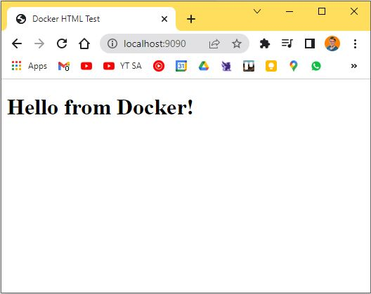

# Task 02

## Steps

### Step 1 - Ubuntu image

- Run command `docker pull ubuntu` in Windows Terminal shell
- Output:

```bash
PS C:\Users\basti> docker pull ubuntu
Using default tag: latest
latest: Pulling from library/ubuntu
4d32b49e2995: Pull complete
Digest: sha256:bea6d19168bbfd6af8d77c2cc3c572114eb5d113e6f422573c93cb605a0e2ffb
Status: Downloaded newer image for ubuntu:latest
docker.io/library/ubuntu:latest
```

- Start with docker CLI:

```bash
PS C:\Users\basti> docker run -it ubuntu
root@e444b39028b9:/# echo "Cloud-Native Computing"
Cloud-Native Computing
root@e444b39028b9:/#
```

### Step 2 - Container logs

- Start container again two times:

```bash
PS C:\Users\basti> docker run -it --name ubuntu_1 ubuntu
root@6e2d45684a25:/# echo "Hello from ubuntu_1"
Hello from ubuntu_1
root@6e2d45684a25:/# ecit
bash: ecit: command not found
root@6e2d45684a25:/# exit
exit

PS C:\Users\basti> docker run -it --name ubuntu_2 ubuntu
root@c8c33e025e34:/# echo "Hello from ubuntu_2"
Hello from ubuntu_2
root@c8c33e025e34:/# exit
exit
```

- Get their logs:

```bash
PS C:\Users\basti> docker logs ubuntu_1
root@6e2d45684a25:/# echo "Hello from ubuntu_1"
Hello from ubuntu_1
root@6e2d45684a25:/# exit
exit

PS C:\Users\basti> docker logs ubuntu_2
root@c8c33e025e34:/# echo "Hello from ubuntu_2"
Hello from ubuntu_2
root@c8c33e025e34:/# exit
exit
```

## Step 03 - Delete the containers

- Show containers:

```bash
PS C:\Users\basti> docker container ls --all
CONTAINER ID   IMAGE          COMMAND                  CREATED              STATUS                          PORTS     NAMES
c8c33e025e34   ubuntu         "bash"                   About a minute ago   Exited (0) About a minute ago             ubuntu_2
6e2d45684a25   ubuntu         "bash"                   2 minutes ago        Exited (127) 2 minutes ago                ubuntu_1
```

- Delete them:

```bash
PS C:\Users\basti> docker rm c8c33e025e34 6e2d45684a25
c8c33e025e34
6e2d45684a25
```

## Step 04 - nginxdemos/hello image demo

- Pull the image:

```bash
C:\Users\basti\Documents\Git-Repos\Cloud-Native-Computing-INM1>docker pull nginxdemos/hello
Using default tag: latest
latest: Pulling from nginxdemos/hello
40e059520d19: Pull complete
f206cf0d6188: Pull complete
065a4ca9176e: Pull complete
67124ec378c3: Pull complete
b17ba2c5bc9f: Pull complete
fed8f5509a6a: Pull complete
9531b1a7b6e7: Pull complete
4dbb211673a7: Pull complete
7ab4e456319a: Pull complete
Digest: sha256:416a824cba708fdb63c8769156baf1e64bcc467049cb247cad7e11bb517ca410
Status: Downloaded newer image for nginxdemos/hello:latest
docker.io/nginxdemos/hello:latest
```

- Start it with a forwarded port and name

```bash
basti@BASTIAN-RTX2080 MINGW64 ~/Documents/Git-Repos/Cloud-Native-Computing-INM1 (main)
$ docker run -d --name nginxdemo -p 9090:80 nginxdemos/hello
9142dfba2a6fdc73de2b09eae0dffbc754ce1ac4c43843a28092dfc4633db352
```

- Get the server address:

```bash
basti@BASTIAN-RTX2080 MINGW64 ~/Documents/Git-Repos/Cloud-Native-Computing-INM1 (main)
$ curl localhost:9090 | grep address
  % Total    % Received % Xferd  Average Speed   Time    Time     Time  Current
                                 Dload  Upload   Total   Spent    Left  Speed
100  7218    0  7218    0     0   507k      0 --:--:-- --:--:-- --:--:--  542k
<p><span>Server&nbsp;address:</span> <span>172.17.0.2:80</span></p>
```

### Step 5 - Stop and delete the container

```bash
basti@BASTIAN-RTX2080 MINGW64 ~/Documents/Git-Repos/Cloud-Native-Computing-INM1 (main)
$ docker stop nginxdemo
nginxdemo

basti@BASTIAN-RTX2080 MINGW64 ~/Documents/Git-Repos/Cloud-Native-Computing-INM1 (main)
$ docker rm nginxdemo
nginxdemo
```

- Verify that the container is no longer there:

```bash
basti@BASTIAN-RTX2080 MINGW64 ~/Documents/Git-Repos/Cloud-Native-Computing-INM1 (main)
$ docker container ls -a
CONTAINER ID   IMAGE          COMMAND                  CREATED        STATUS                      PORTS     NAMES
```

### Steps 6-7 - View HTML file with nginx

- Create HTML demo file:

```bash
C:\Users\basti\Documents\Git-Repos\Cloud-Native-Computing-INM1>more E:\Downloads\html_test\index.html
<!DOCTYPE html>
<html lang="en">
<head>
    <meta charset="UTF-8">
    <meta http-equiv="X-UA-Compatible" content="IE=edge">
    <meta name="viewport" content="width=device-width, initial-scale=1.0">
    <title>Document</title>
</head>
<body>
    <h1>Hello from Docker!</h1>
</body>
</html>
```

- Start an nginx container and link the file into it

```bash
basti@BASTIAN-RTX2080 MINGW64 ~/Documents/Git-Repos/Cloud-Native-Computing-INM1 (main)
$ docker run -d --name nginxhtmlfiledemo -p 9090:80 -v E:/Downloads/html_test:/usr/share/nginx/html --rm  nginx
0ef47ab648530bc21be649dbc3a5ab425074760f83e79bbd1e746ab66a77c1a1
```

- Check if file is served correctly

```bash
basti@BASTIAN-RTX2080 MINGW64 ~/Documents/Git-Repos/Cloud-Native-Computing-INM1 (main)
$ curl localhost:9090
<!DOCTYPE html>
<html lang="en">
<head>
    <meta charset="UTF-8">
    <meta http-equiv="X-UA-Compatible" content="IE=edge">
    <meta name="viewport" content="width=device-width, initial-scale=1.0">
    <title>Document</title>
</head>
<body>
    <h1>Hello from Docker!</h1>
</body>
</html>
```

- Browser Screenshot:



### Step 8 - Delete the container

- Stop and delete the running container:

```bash
basti@BASTIAN-RTX2080 MINGW64 ~/Documents/Git-Repos/Cloud-Native-Computing-INM1 (main)
$ docker stop nginxhtmlfiledemo
nginxhtmlfiledemo
```

- Verify with `docker ps`

```bash
basti@BASTIAN-RTX2080 MINGW64 ~/Documents/Git-Repos/Cloud-Native-Computing-INM1 (main)
$ docker ps
CONTAINER ID   IMAGE     COMMAND   CREATED   STATUS    PORTS     NAMES
```
